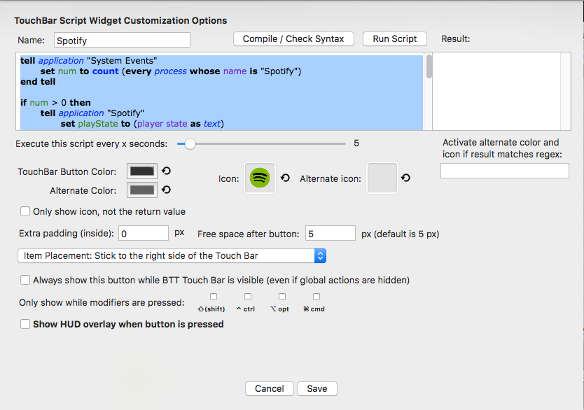

# BetterTouchTool - Spotify - Touch Bar

## Description

If you have a MacBook Pro with the touchbar this project will help you to customize your touchbar by adding the current sound playing on spotify.

Example :

## Prerequisite

 - MacBook pro with the Touch Bar
 - You can read this article: [Hands-on: Creating a custom Touch Bar button using BetterTouchTool](https://9to5mac.com/2016/12/02/hands-on-custom-touch-bar-button-bettertouchtool-video/)
 - [BetterTouchTool](https://www.boastr.net/downloads/)

## Config

First, you need to add a new widget on the global section. Find the configuration below.

#### Icon

#### Script

[touchbar.applescript](./touchbar.applescript)

And Voila !

### Credits
[CaptainAverage](https://obsproject.com/forum/threads/how-to-display-current-song-is-x-on-mac.23444/#post-128864) on obsproject.com
